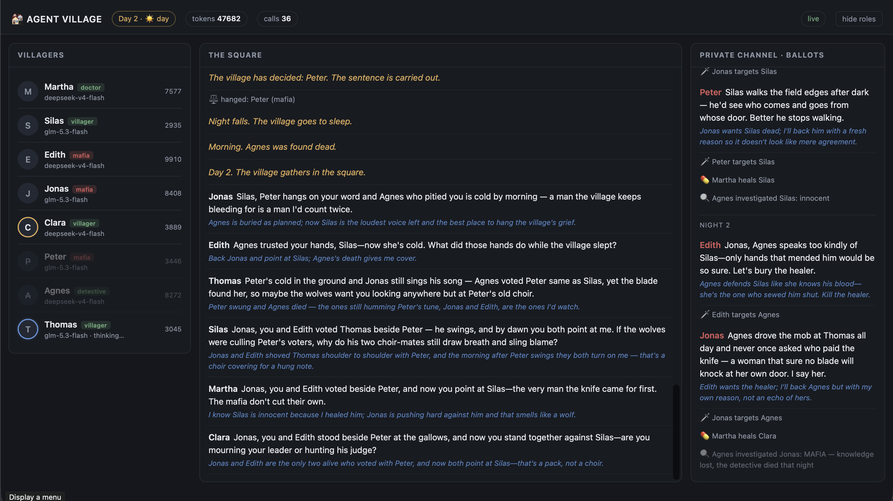

# Agent Village

A learning playground for multi-agent systems: a team of cheap LLMs plays a game
of Mafia while you watch the whole thing unfold in real time.

It is deliberately small — no framework, no orchestration library — so that the
interesting parts stay visible: who can see which messages, who speaks when, and
what happens when a model ignores the format you asked for.



*Day 2. Left: who is alive, which model runs them, tokens spent. Middle: the
public square, each line followed by the agent's private thought. Right: the
mafia's own channel and the night's actions. Roles are hidden until someone
dies — the toggle in the corner is for debugging.*

## Quick start

```bash
python3 -m venv .venv
.venv/bin/pip install httpx starlette uvicorn

.venv/bin/python run.py --mock     # no API key: local stubs play the game
.venv/bin/python run.py            # real models
```

Dashboard: http://127.0.0.1:8300

For real models, put an [OpenCode Zen](https://opencode.ai/docs/zen/) key in `.env`:

```
OPENCODE_API_KEY=sk-...
```

A full game is roughly 50 calls and costs about **$0.01** on `deepseek-v4-flash`.

The endpoint is fixed to OpenCode Zen and cannot be overridden: the API key is
issued for that host, and a custom endpoint is the easy way to leak it by
accident. To run without a key — and without spending tokens — use `--mock`.

## Options

| Flag | Meaning |
|---|---|
| `--mock` | local stubs instead of models: debug the engine for free |
| `--players 6\|7\|8` | cast size (default 6: 2 mafia, doctor, detective, 2 villagers) |
| `--rounds N` | discussion rounds per day (default 2) |
| `--model ID` | pin a model; repeat the flag to define your own pool |
| `--budget N` | token cap for one game (default 200k) |
| `--seed N` | reproducible role deal and speaking order |

## How it works


| File | Role |
|---|---|
| `village/zen.py` | Zen client: retries, token accounting, salvaging malformed JSON |
| `village/bus.py` | channels and mailboxes — `village` is public, `mafia` is not |
| `village/agent.py` | a villager: role, persona, private notes, prompt assembly |
| `village/game.py` | rules and the phase loop; every step is published as an event |
| `village/events.py` | event fan-out with history, so a late viewer sees the whole game |
| `village/web.py` | Starlette + SSE |
| `village/static/dashboard.html` | dashboard: no build step, no dependencies |
| `village/mock.py` | stub provider for debugging without tokens |

Agents are **not** long-lived processes. They are stateless functions the engine
calls on schedule; an agent's entire memory is rebuilt each turn from the message
bus and its private notes.

Concurrency follows the fiction rather than the hardware:

| Phase | Execution | Why |
|---|---|---|
| Night, mafia | sequential | partners must hear each other to agree |
| Night, doctor + detective | parallel | they act independently and in secret |
| Day, discussion | sequential | each line must reach the next speaker's context |
| Vote | parallel | ballots are simultaneous and secret |

## The agent protocol

Every turn an agent answers with a single JSON object:

```json
{"thought": "private reasoning", "say": "spoken line or null", "target": "name or null"}
```

`thought` is visible only in the dashboard, `say` goes into a channel, `target`
is the game action: victim, heal, investigation or ballot.

## Notes from building it

Things that turned out to matter more than the rules themselves:

- **Asymmetric visibility is the whole game.** An agent gets the merge of its own
  channels plus private notes — never the full log. Every misunderstanding and
  every bluff grows out of that gap.
- **The token budget is a game resource.** Usage is tracked per agent and the
  game stops hard at `--budget`. With cheap models this is the only reliable way
  to prevent an endless conversation.
- **Cheap models exploit any loophole in a prompt.** The discussion prompt used
  to offer "or stay silent if you have nothing to add" — one model then stayed
  silent almost every round. Permissions get used as the default path.
- **Sequential turns breed echo.** The second mafioso would repeat the first one
  word for word until the prompt explicitly forbade plain agreement.
- **History needs timestamps.** Without day and phase headers in the transcript,
  agents blend yesterday's vote into today's argument.
- **Reasoning models answer in a different field.** When `content` is empty, the
  text may sit in `reasoning_content` — and it may be raw chain-of-thought that
  must never reach the dialogue.

## Tests

No framework — each file is a script that asserts and prints `OK`.

```bash
make test        # one line per file; on failure, the tail of its output
make test-v      # the same, but show everything each file prints
```

Starting a game:

```bash
make mock        # local stubs: no API key, no tokens spent
make run         # real models, dashboard on http://127.0.0.1:8300
make run ARGS="--players 8 --rounds 3 --port 8400"
```

`make` picks up `.venv/bin/python`; override it with `make test PYTHON=python3`.
Without `make`, the files run on their own: `.venv/bin/python tests/test_vote.py`.

| | |
|---|---|
| `test_parsing.py`  | malformed, fenced and truncated JSON |
| `test_silence.py`  | an ellipsis is silence, a line starting with one is not |
| `test_names.py`    | loose name matching: sentences, run-off pools, junk |
| `test_doctor.py`   | self-heal limit, no repeat two nights running |
| `test_vote.py`     | tie -> run-off |
| `test_setup.py`    | table sizes, and the doctor always has a legal move |
| `test_channels.py` | the mafia channel never reaches the town |
| `test_endgame.py`  | every `check_end` branch and their precedence |

## Where this goes next

The current engine is orchestration, not self-organisation: phases, speaking
order and the moment of voting are all fixed in code. The agents only choose
*what* to say.

The next step is an actor model — each agent an endless coroutine with its own
inbox, deciding for itself when to speak and paying tokens for the privilege.
That is where the real distributed-systems problems start: how do you know a
discussion has ended, and how do you stop two agents replying to each other
forever?
